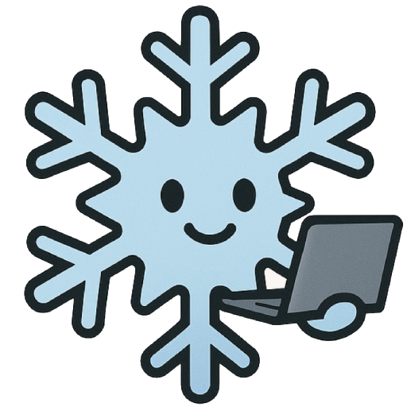

# FrostByte 2025
Join us for the first edition of *FrostByte*, a meeting for computational cryo-EM methods developers in the San Francisco Bay Area.

<figure markdown="span">
  { width="250" }
</figure>

<b>11:30-17:00</b>
 
<b>Wednesday 11th June 2025</b>
 
<b>Sports Basement - Redwood City</b>

This is an event for the Bay Area cryo-EM methods community to connect, share practical insights, and discuss day-to-day challenges. While we welcome attendees from all backgrounds and roles, the focus will be on technical discussions among those directly engaged with computational methods in their daily work.

## Schedule

- **11:30 - 12:30**: mingling + 🍕
- **12:30 - 14:15**: flash talks ⚡
- **14:15 - 14:45**: break 💬
- **14:45 - 16:30**: demo session
- **16:30 - 16:55**: more mingling
- **16:55 - 17:05**: closing remarks 👋

## Registration

Registration is now closed.

## Program

### Flash Talks

- Adam Marko
- Utz Ermel
- Arthur Zalevsky
- Laurel Kinman
- Dari Kimanius
- Kithmini Herath
- Alister Burt
- Yilai Li
- Jonathan Schwartz
- Daoyi Li

### Demos

- Shawn Zheng
- Matthew Giammar
- Dimitry Tegunov
- Arthur Zalevsky
- Alister Burt
- Dari Kimanius
- Utz Ermel

## Organizers

- Alister Burt (Genentech)
- Ariana Peck (CZII)
- Josh Dickerson (UC Berkeley)
